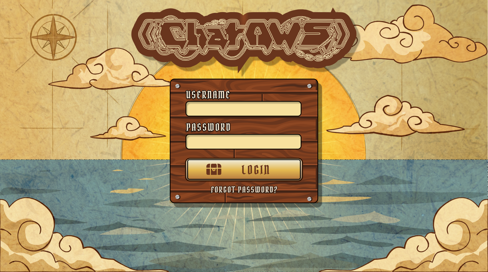
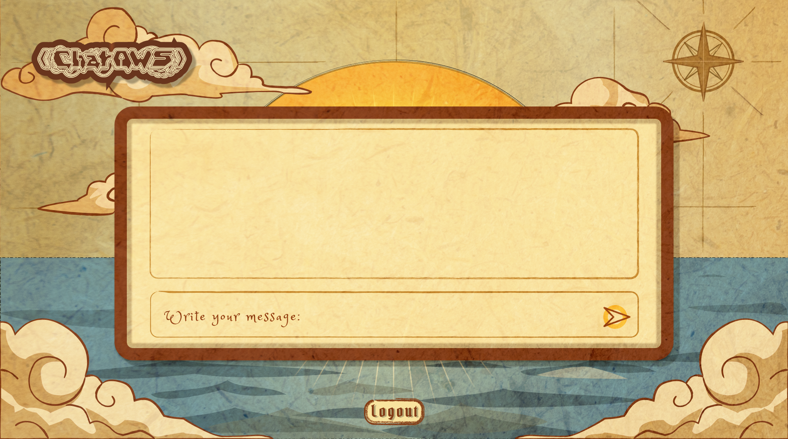
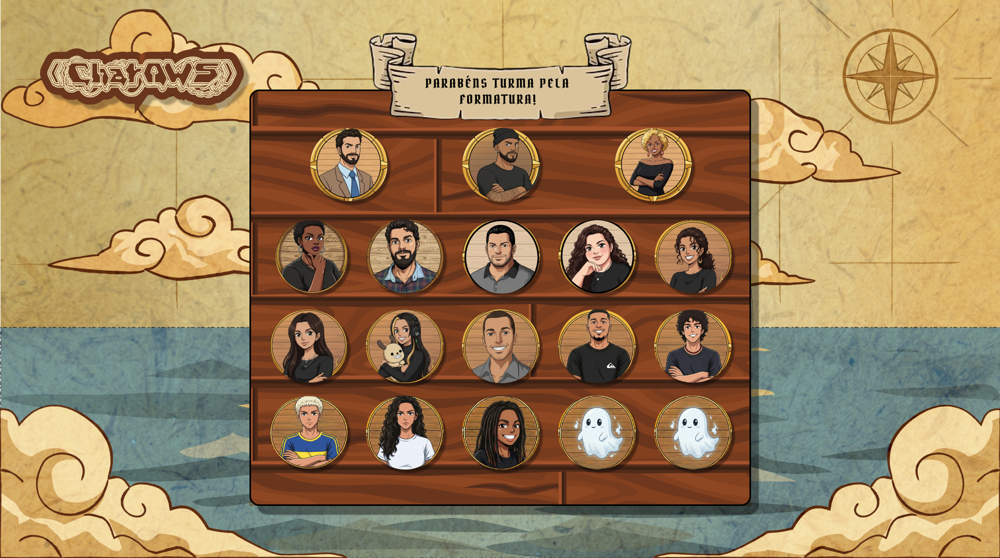

# 🏴‍☠️ ChatAWS

> **Microsserviço de chat com arquitetura em camadas, autenticação JWT e containerização.**


---

### 🚀 Quick Start (Rodar Agora)

[](#-como-rodar-com-docker)

---

## 📋 Sobre o Projeto

Este repositório faz parte do meu portfólio profissional. O projeto nasceu da motivação de criar um **Micro-SaaS** de mensageiro, servindo como ferramenta educativa para auxiliar alunos a entenderem deploys na AWS, Docker e arquitetura de software de forma interativa e gamificada.

O foco principal é a **Arquitetura de Backend**, demonstrando domínio em:
* **Arquitetura em Camadas:** Separação clara entre Rotas, Lógica de Negócio e Banco de Dados.
* **Clean Code:** Código legível e organizado.
* **Segurança:** Hashing de senhas com Bcrypt e Tokens JWT.
* **DevOps:** Ambiente de desenvolvimento padronizado via Docker.

---

## 🛠️ Tecnologias

* **Linguagem:** Python 3.10+
* **API & Segurança:** Flask, Flask-JWT-Extended
* **CLI (Terminal):** Rich, Questionary
* **Infraestrutura:** Docker, Docker Compose
* **Documentação:** Swagger (Flasgger)

---

## 🎨 Roadmap do Frontend (Em Construção)

Atualmente, o sistema opera via CLI, mas uma interface gráfica imersiva está sendo desenvolvida utilizando **React, Tailwind CSS e Framer Motion**. O objetivo é criar uma experiência de usuário gamificada, com temática de **anime pirata**.
### 📐 Design Protótipo

[](https://www.figma.com/proto/ieepNSqImRSsxcAvb7gmBX/ChatAWS?node-id=13-11&t=Ih32VTTGBoyyELDU-0&scaling=min-zoom&content-scaling=fixed&page-id=0%3A1)

> Clique no botão acima para explorar o Design System, componentes e fluxo de telas em alta fidelidade.

### Prévias do Design (Figma):

| Tela de Login (Conceito) | Painel de Chat (Conceito) | Painel Alunos| Painel Background |
|:---:|:---:|:---:|:---:|
|  |  |  |  | 
| *Login com animações de parallax e pergaminho* | *Chat em tempo real sobre o mapa* | *Painel com a pagina de formtura da classe* | *UI do Background*

> 🚧 **Status:** A implementação deste design iniciará na próxima sprint.

---

## 🚀 Como Rodar (Com Docker)

Você não precisa instalar Python ou configurar banco de dados. O Docker resolve isso.

1. **Clone o repositório:**
   ```bash
   git clone https://github.com/7mistas/ChatAWS-API.git
   cd ChatAWS-API
   ```
2. **Configure o Ambiente:**
Crie um arquivo `.env` na raiz (veja o exemplo abaixo):
   ```Ini
   FLASK_ENV=production
   JWT_SECRET_KEY=sua_chave_secreta
   API_URL= http://127.0.0.1:5000
   ```
3. **Suba o ambiente:**
   ```bash
   docker compose up --build -d
   ```
## 🚀 Rodar com Makefile (opcional)

```bash
make up
```
## 🧪 Como Testar
**Opção A:** Via Documentação (Swagger)
Acesse no seu navegador: 👉 http://localhost:5000/docs

   1. Crie um usuário em POST /auth/register.

   2. Faça login em POST /auth/login e copie o Token.

   3. Clique no botão Authorize (cadeado) e cole: Bearer SEU_TOKEN.

   4. Teste as rotas de /messages.

**Opção B:** Via Cliente CLI (Python Local)
Se quiser rodar o cliente de terminal para interagir com o Docker

1. Crie um ambiente virtual: 
   ```bash
   python3 -m venv venv
   ```
2. Ative o ambiente virtual:
   ```bash 
   source venv/bin/activate
   ```
3. Instale as dependências: 
   ```bash
   pip install -r requirements.txt
   ```
4. Rode a aplicação:
   ```bash
   python3 main.py
   ```
## Estrutura do Projeto
```plaintext
   ChatAWS/
├── 📂 data/                 # Persistência do Banco de Dados (Volume Docker)
├── 📂 logs/                 # Logs de execução da API
├── 📂 frontend/             # Aplicação React (Vite)
│
├── 📂 src/                  # Código Fonte do Backend
│   ├── auth.py              # Lógica de Autenticação
│   ├── chat.py              # Lógica de Mensagens
│   ├── database/            # Camada de Dados (SQL)
│   └── ...
│
├── app.py                   # Ponto de entrada da API (Rotas Flask)
├── main.py                  # Cliente CLI interativo (Rich, Questionary)
├── Makefile                 # Atalhos de comandos Docker
├── Dockerfile               # Receita da Imagem
└── docker-compose.yml       # Orquestrador dos Containers
```
## ✨ Features

*  Login com JWT
- Registro de usuário com hashing
- Chat persistido em SQLite
- API documentada com Swagger
- Interface CLI interativa (Rich + Questionary)
- Containerização completa com Docker

## 👨‍💻 Autor
**Levi Silva de Assis (Mista)**

* [LinkedIn](https://linkedin.com/in/7mistas/)
* [Portfólio](https://github.com/7mistas)

Este projeto está sob a licença **MIT** - sinta-se à vontade para compartilhar e explorar!
